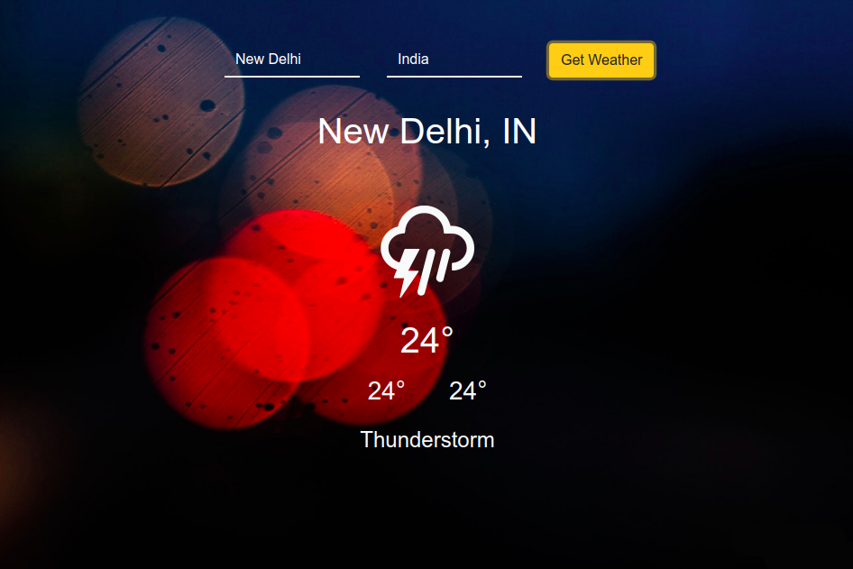

# Weather-App
A weather app in React.js

## Preview


## Installation
In order to run the weather app, run the following commands on terminal
```
git clone https://github.com/kuruma99/Weather-App.git
cd Weather-App
npm install 
npm start
```

## Requirements
* Recent version of node.js
* npm
* A web browser

## Features
- [x] Uses React.js
- [x] Used Bootstrap
- [x] No use of Redux or ContextAPI

## Extra 
* **Icons** : erikflowers/weather-icons
* **API** : OpenWeatherMap
